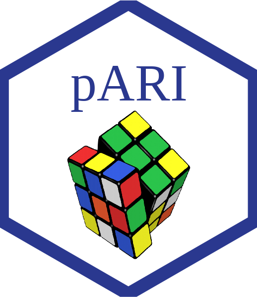

# pARI
[](https://doi.org/10.5281/zenodo.4275924)

**pARI** is the package developed to compute the permutation-based All-Resolution Inference (ARI) method. Therefore, this method does not assume any distribution of the null distribution of the p-values. It needs to satisfy the exchangeability assumption as all permutation-based methods. For further details, please refers to (TODO).

As the parametric [ARI](https://www.sciencedirect.com/science/article/abs/pii/S105381191830675X?via%3Dihub), this method aims to compute simultaneous lower confidence bounds for the number of true discoveries, i.e., active voxels, in the fMRI framework. The function takes as input the list of copes, i.e., contrast maps, one for each subject, given by neuroimaging tools as FSL, SPM, etc. 

Having these data, you can insert a cluster map that can be the high-level output from some neuroimaging software, a region of interests (ROI), etc. If you want to construct these cluster maps using a supra-threshold statistic rule, you can specify the threshold into the argument ```thr``` of the function.

Therefore, the function ```pARIbrain``` returns the lower bounds of true discoveries, i.e., active voxels, for each cluster coming from the cluster map inserted.

You can insert these cluster maps as many times as you want, because the Permutation-based ARI, as the parametric version, allows for **circular analysis**, still controlling for the multiplicity of inferences.

<!-- badges: start -->
<!-- badges: end -->

## Installation

You can install the released version of pARI with:

``` r
devtools::install_github("angeella/pARI")
```

## Simulation

Here, you can perform a toy example, using simulated data where the tests under the null hypotheses come from a Normal distribution with mean $0$ and variance $0.05$ and the tests under the alternative come from a Normal distribution with mean $10$ and variance $0.05$. We simulate $10$ tests under the null and $10$ under the alternative considering $10$ observations. Therefore, we have a matrix with dimensions $10 \times 20$, where the rows represent the observations and the columns the variables, i.e., tests.

We expect that the lower bound of the number of true discoveries, considering the full set of hypotheses, equals to $10$.

``` r
library(pARI)

m <- 20 #number of tests
n <- 10 #number of observations
X <- matrix(rnorm(0.5*m*n, 0, 0.05),ncol=n,nrow=0.5*m) #tests under the null
Y <- matrix(rnorm(0.5*m*n, 10, 0.05),ncol=n,nrow=0.5*m) #tests under the alternative
data <- cbind(X,Y) #full set of datasets

```
Then, we perform the sign-flipping test, using $2^n = 1024$ permutations, thanks to the function ```signTest```(type ```?pARI::signTest``` for more details):

``` r
pvalues <- signTest(data, 2^n)
```
and we plot it in $-log_{10}$ scale:

``` r
plot(-log(pvalues$pv,base = 10), pch = 20)
```
We create the p-values matrix where the rows represent the permutations and the columns the variables, i.e., the first row represents the observed p-values; the remain rows represent the p-values under the null distribution.

``` r
pv <- t(cbind(pvalues$pv,pvalues$pv_H0))
```

Then, we use the parametric approach considering the full set of hypotheses, i.e., ```ix``` equals ```c(1:5)```, using the function ```hommel``` and ```discoveries``` from the hommel package (type ```?hommel::hommel``` and ```hommel::discoveries``` for more details):

``` r
hom <- hommel(pv[1,], simes = TRUE)
discoveries(hom,ix = c(1:8),alpha = 0.1)

```
and the permutation-based one using the function ```pARI``` (type ```?pARI::pARI``` for more details)

``` r
pARI(data,ix = c(1:8),alpha = 0.1,family = "Simes", B= 1000)[1]

```

We have at least $10$ true discoveries considering the full set of hypotheses.

## fMRI data 

You can find several data sets in the [fMRIdata](https://github.com/angeella/fMRIdata) package. So, first of all you need to install it:

``` r
devtools::install_github("angeella/fMRIdata")
```

This is a basic example using fMRI data from the [Auditory dataset](https://openneuro.org/datasets/ds000116/versions/00003). We need the following data:


 **1.** The **list of copes**, one for each subject, in nifti file format: 

``` r
data(Auditory_copes)
str(Auditory_copes)
```

Alternatively, you can construct the list of copes using your data in this way:
  - Rename the nifti files as ```sub-x``` where ```x``` is the number identifying the subjects, e.g., ```sub-1```, ```sub-2``` and so on.
  - Write in ```max_sub``` the last ```x``` number of your set of subjects.
  - Write in ```path``` the path where your set of nifti files is

``` r
Auditory_copes <- list()
path <- #write here your path where your set of nifti files is. Don't put the last /
max_sub <- #write here you last x id subjects
sub_ids <- sapply(c(1:max_sub),function(x) paste0(x))
for (sid in 1:length(sub_ids)) {  
  Auditory_copes[[sid]] <- RNifti::readNifti(paste0(path,"/sub-", sub_ids[sid] , ".nii.gz"))
  
}

```


 **2.** the **mask**, which is a 3D array of logicals (i.e. TRUE/FALSE means in/out of the brain). Alternatively, it may be a (character) nifti file name. If omitted, all voxels are considered.

``` r
data(Auditory_mask)
str(Auditory_mask)
```

 **3.** the $\alpha$ level value and the **threshold** in order to perform the cluster map using a supra-threshold statistic rule: 

``` r
alpha = 0.1
thr = 3.2
```

then we can perform the Permutation-based ARI using the function ```pARIbrain```(type ```?pARI::pARIbrain``` for more details):

``` r
out <- pARIbrain(Auditory_copes,thr=thr,mask=mask,alpha = alpha)
```
if you prefer to insert some cluster map, you can just add the argument ```cluster``` instead of ```thr```. The argument ```cluster``` accepts the map as nifti file or as character name (path where the cluster map is). You can create the Random Field Theory based cluster map using FSL. Let the Statmap, that you can compute using 

``` r
Statmap(copes,alternative = "two.sided",path = "your path",mask = mask)
```

P.S: If you are using your copes images, before using the function ```Statmap``` you need to perform an affine registration using the command ```flirt``` of FSL to have the copes images with dimensions 91 x 109 x 91 instead of 64 x 64 x 30:

```flirt  -in /your_feat_directory/stats/cope3.nii -ref /your_feat_directory/reg/standard.nii  -applyxfm -init /your_feat_directory/reg/example_func2standard.mat -out cope_flirt```

the new cope image in this case is called ```cope_flirt```.

After using the ```Statmap``` function, you need to type in R:

``` r
mask <- mask_path
Statmap <- Statmap_path

mask <- RNifti::readNifti(mask)
Statmap <- RNifti::readNifti(Statmap)
mask=mask!=0
Statmap[!mask]=0
RNifti::writeNifti(Statmap, file = "Statmap.nii.gz")
```
So, you have the Statmap.nii.gz that you will use in FSL to perform the cluster analysis, typing in the shell the following commands:

```fslmaths Statmap.nii.gz -mas mask.nii.gz Statmap_mask.nii.gz```

```smoothest -d X -r res4d -m mask```

where X is the number of subjects. Then, you have the smoothness estimate value (DLH) and the number of voxels in the mask (VOLUME) that you insert in the following command:

```cluster -i Statmap_mask -t 3.2 -p 1 --dlh=DLH –volume=VOLUME --mm -o cluster.nii > cluster.txt```

Then, the cluster.nii is the cluster map that you can use in ARI.

For help about this FSL code, see [the FSL book code](https://fsl.fmrib.ox.ac.uk/fsl/fslwiki/Cluster). 

Finally, you can produce also the True Discovey Proportion brain map (type ```?pARI::map_TDP``` for more details):

``` r
map_TDP(out,path= getwd(), name = "tdp", mask)
```

Then, you can compare it with the parametric method ARI using the [ARI](https://github.com/angeella/ARIbrain) package: 

``` r
data(Auditory_Pmap)
data(Auditory_mask)
data(Auditory_Statmap)

#Create Clusters using a threshold equal to 3.2
Statmap = get_array(Statmap)
mask = get_array(mask)
Statmap[!mask]=0
clstr=cluster_threshold(Statmap>3.2)

res_ARI=ARIbrain::ARI(Pmap = Pmap, clusters= clstr, mask=mask, Statmap = Statmap, alpha = alpha)

```
# References

Rosenblatt, J. D., Finos, L., W., W. D., Solari, A., and Goeman, J. J. (2018). All-resolutions inference for brain imaging. NeuroImage, 181:786-796.

Hemerik, J., Solari, A., and Goeman, J. J. (2019). Permutation-based simultaneous confidence bounds for the false discovery proportion. Biometrika, 106(3):635-649.

Eklund, A., Nichols, E. T., and Knutsson, H. (2016). Cluster failure: Why fmri inferences for spatial extent have inflated false-positive rates. Pnas, 113(28):7900-7905.

# Did you find some bugs?

Please write to angela.andreella[\at]stat[\dot]unipd[\dot]it or insert a reproducible example using [reprex](https://github.com/tidyverse/reprex) on my [issue github page](https://github.com/angeella/pARI/issues).

